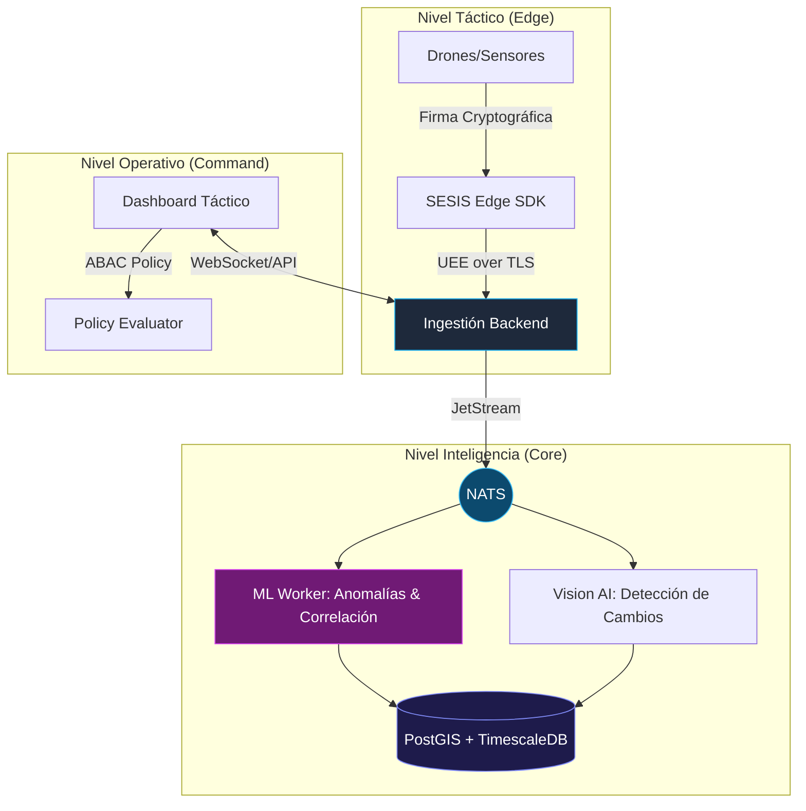

# 🛡️ SESIS: Sistema de Inteligencia y Conciencia Situacional Soberana

> **⚠️ AVISO LEGAL CRÍTICO:** Este software es **PROPIEDAD PRIVADA EXCLUSIVA**. Desarrollado específicamente para Fuerzas Armadas y Agencias de Inteligencia. Su clonación, difusión, ingeniería inversa o uso no autorizado será perseguido mediante **ACCIONES JUDICIALES PENALES Y CIVILES** bajo las leyes de propiedad intelectual y seguridad nacional.

---

## 🛰️ Visión General
**SESIS** (Soberano UE, Coalition-ready, Defensivo) es una plataforma multi-agente de nueva generación diseñada para el dominio de la información en teatros de operaciones complejos. Permite la integración de sensores en tiempo real, análisis de inteligencia artificial en el borde (Edge AI) y una visualización táctica unificada.

### 💎 Capacidades Core
- **Mecanismo de Ingesta Soberana**: Protocolo **UEE v1** (Universal Event Envelope) con firma criptográfica obligatoria.
- **Cognición Situacional**: Detección de anomalías por IA y correlación multi-dominio (RF + Geo + CV).
- **Control de Acceso ABAC**: Autorización granular basada en atributos (Sujeto, Recurso, Contexto de Misión).
- **Arquitectura Inmune**: Basada en mTLS y buses de datos endurecidos (NATS JetStream).

---

## 📊 Arquitectura del Sistema



---

## 🚀 Despliegue Rápido (Entorno de Operaciones)

SESIS está diseñado para ser desplegado en infraestructuras locales soberanas mediante contenedores endurecidos.

```bash
# Sincronización de secretos y despliegue del stack
docker-compose up -d --build
```

### Servicios Activos:
- **Command Engine**: Port 8000 (FastAPI)
- **Tactical UI**: Port 3000 (React / Nginx)
- **Intelligence Bus**: Port 4222 (NATS)
- **Tactical Storage**: Port 5432 (PostgreSQL/Timescale)

---

## 🛠️ Stack Tecnológico Militar
| Componente | Tecnología | Propósito |
| :--- | :--- | :--- |
| **Backend** | Python / FastAPI (Async) | Orquestación de datos de misión |
| **Edge SDK** | Kotlin | Integración nativa con assets tácticos |
| **IA/ML** | PyTorch / NumPy | Detección de amenazas y Vision AI |
| **Database** | PostGIS / TimescaleDB | Memoria táctica espacial y temporal |
| **Bus** | NATS JetStream | Comunicación multi-agente persistente |
| **Seguridad** | JWS / mTLS | Integridad y confidencialidad absoluta |

---

## 🔒 Auditoría y Seguridad
Cada acción realizada en SESIS genera una entrada en el **Append-only Audit Trail**, asegurando una trazabilidad total del operador y del sistema. Nadie puede borrar su rastro.

---
© 2026. Todos los derechos reservados por el Autor. **Clasificación: CONFIDENCIAL**.
