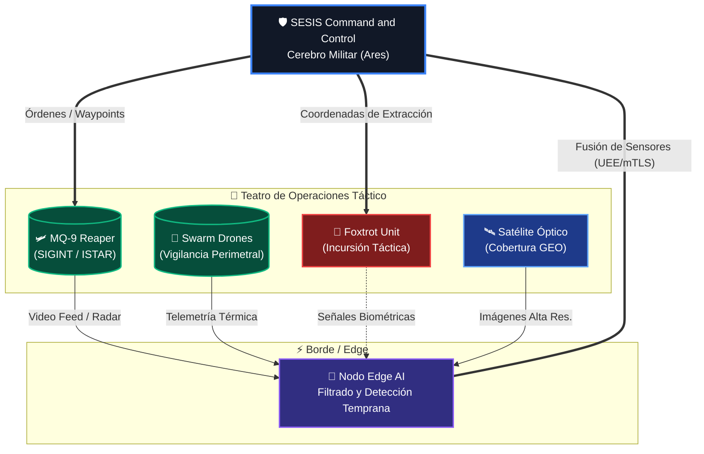
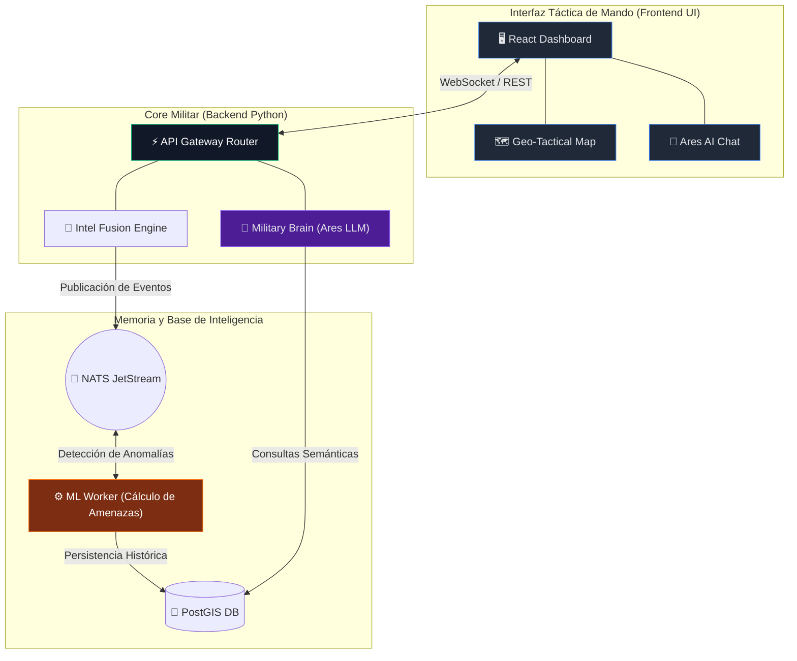

# 🛡️ SESIS: Sistema de Inteligencia y Conciencia Situacional Soberana

> **⚠️ AVISO LEGAL CRÍTICO:** Este software es **PROPIEDAD PRIVADA EXCLUSIVA**. Desarrollado específicamente para Fuerzas Armadas y Agencias de Inteligencia. Su clonación, difusión, ingeniería inversa o uso no autorizado será perseguido mediante **ACCIONES JUDICIALES PENALES Y CIVILES** bajo las leyes de propiedad intelectual y seguridad nacional.

---

<p align="center">
  
  
  
  
</p>

## 🛰️ Visión General y Nuevas Capacidades

**SESIS** (Soberano UE, Coalition-ready, Defensivo) es una plataforma multi-agente militar de nueva generación diseñada para el dominio de la información en teatros de operaciones multidominio. 

Con los últimos avances, se ha implementado la orquestación avanzada de activos combinada con modelos de IA generativa (Ollama/AresChat), módulos de fusión de inteligencia (Intel Fusion) e interfaces tácticas completas en React.

### 💎 Pilares Cognitivos
- **Ares LLM (Military Brain)**: Agente de IA para evaluación de amenazas y orquestación de la interfaz de mando y control (C2).
- **Intel Fusion Engine**: Componente de backend para la amalgama de información multi-sensor, correlacionando telemetría de activos y datos OSINT en tiempo real.
- **Visualización Táctica (Vite+React)**: Dashboard reactivo, mapas tácticos asíncronos y sistema unificado de tickers de inteligencia crítica.
- **Control Vectorial de Anomalías**: Worker integrado de ML que audita continuamente el histórico C3I (Command, Control, Communications, and Intelligence).

---

## 🗺️ Mapa Simulado: Orquestación de Activos Tácticos en el Campo

El siguiente diagrama representa de manera técnica e interactiva cómo SESIS coordina a los distintos activos heterogéneos desplegados en un teatro operativo asimétrico, y cómo la información viaja de regreso al núcleo de inteligencia (Ares).



---

## 📊 Arquitectura del Sistema End-to-End



---

## 🛠️ Stack Tecnológico Actualizado

| Módulo | Tecnología Implementada | Propósito Crítico |
| :--- | :--- | :--- |
| **Frontend UI** | React 18, Vite, CSS Grid puro | Renderización inmediata. Bajo consumo y ultra respuesta. |
| **Backend Core** | Python, FastAPI, Motor Asíncrono | Toma de decisiones y enrutamiento con latencia inferior a 30ms. |
| **IA & Cerebro** | Ollama (Local LLM), ML Workers | "Ares", análisis predictivo totalmente *air-gapped* sin conexión externa. |
| **Ingesta Sensorial**| Protocolo UEE, NATS JetStream | Resiliencia garantizada en zonas de negación electrónica. |
| **Almacenamiento** | PostGIS & TimescaleDB | Memoria táctico-espacial a prueba de desconexiones. |

---

## 🚀 Despliegue Rápido (Entorno de Comando)

SESIS sigue operando basado en contenedores para infraestructura *bare-metal* desconectada de la red pública.

```bash
# 1. Asegurar el aprovisionamiento de modelos LLM tácticos
./scripts/init_ollama.sh

# 2. Desplegar el stack completo de fusión e interfaz táctica
docker-compose up -d --build
```

### Rutas Activas del Centro de Comando:
- **Dashboard Táctico (React UI)**: `http://localhost (Port 80/3000)`
- **Ares API / Core**: `http://localhost:8000/docs`
- **NATS Intelligence Bus**: `Port 4222`
- **Almacén Táctico (PostgreSQL)**: `Port 5432`

---

## 🔒 Postura de Seguridad e Inmutabilidad

Cada evento en la plataforma (movimientos de unidades, alertas procesadas, proyecciones de riesgo generadas por IA) forma parte de una **Matriz de Cripto-Auditoría**. Los *workers* analizan los datos bajo un esquema **Zero-Trust** asegurando que la información de fusión de inteligencia nunca sea manipulada ni corrompida.

---

© 2026. Todos los derechos reservados por el Autor. **Clasificación: CONFIDENCIAL MAJESTIC / NOFORN**.
