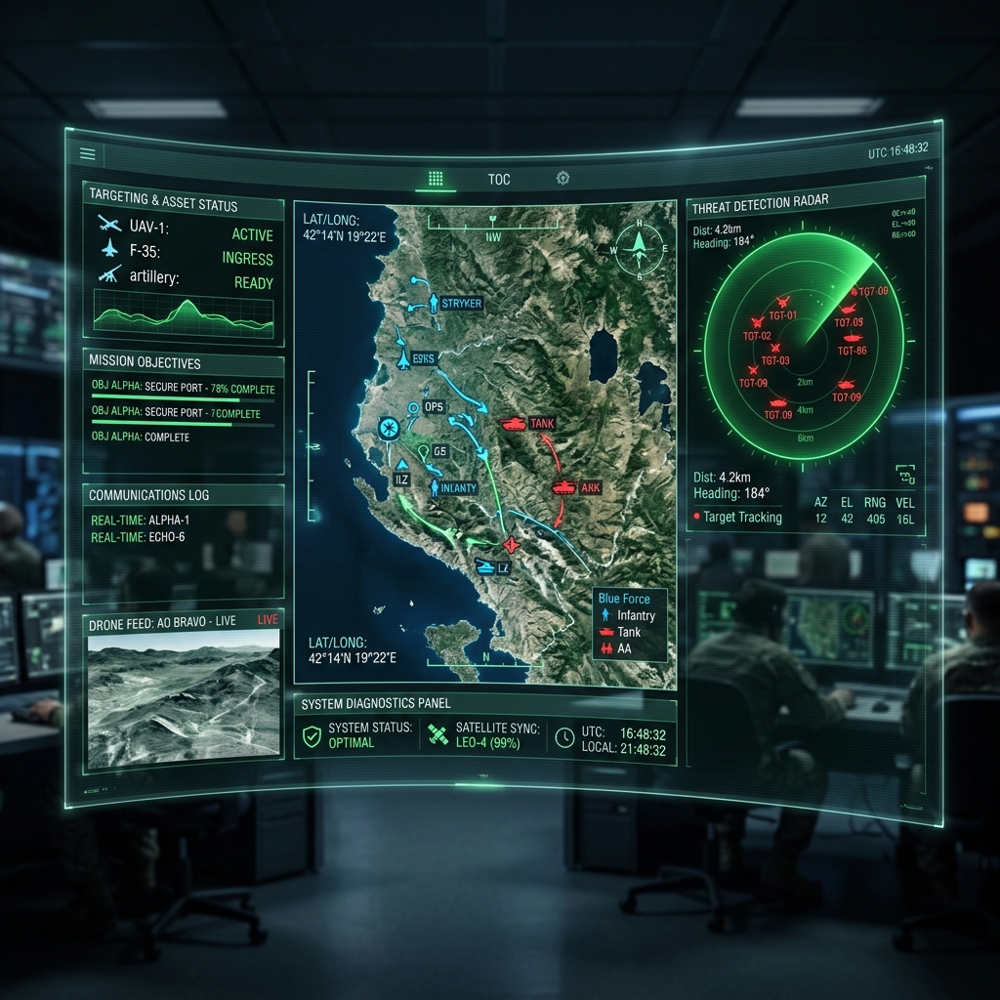
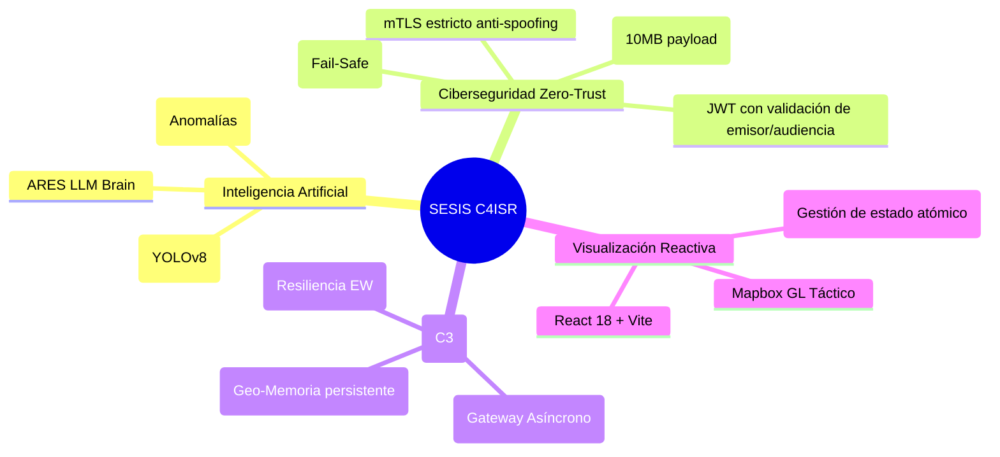
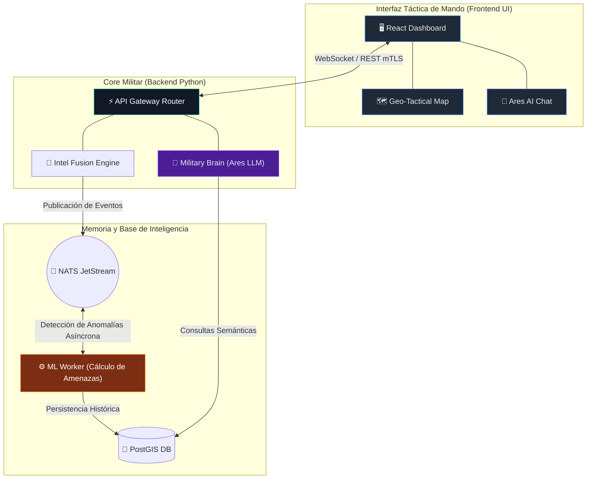

# 🛡️ SESIS: Sistema de Inteligencia y Conciencia Situacional Soberana

> **⚠️ AVISO LEGAL:** Este software es **PROPIEDAD PRIVADA EXCLUSIVA**. Desarrollado para Fuerzas Armadas y Agencias de Inteligencia. Su clonación, difusión, ingeniería inversa o uso no autorizado será perseguido bajo las leyes de propiedad intelectual y seguridad nacional.
>
> **Clasificación máxima admisible del prototipo actual: `RESTRICTED / FOR OFFICIAL USE ONLY (FOUO)`.** El sistema **NO** está acreditado para operar con datos `CONFIDENTIAL`, `SECRET` ni `TOP SECRET / NOFORN` hasta que se cierren los controles NIST SP 800‑53 (AC‑3, AU‑9, AU‑10, IA‑5, SC‑12, SI‑7) actualmente pendientes (verificación JWS, integración HSM/PKCS#11, mTLS asimétrico extremo‑a‑extremo, accreditation/ATO formal).

---

<p align="center">
  
  
  
  
</p>



## 🛰️ Visión General y Nuevas Capacidades (Fase de Endurecimiento)

**SESIS** (Soberano UE, Coalition-ready, Defensivo) es una plataforma multi-agente militar de nueva generación diseñada para el dominio de la información en teatros de operaciones multidominio. 

Con los últimos avances en ciberdefensa y DevSecOps militar, el sistema ha sido recertificado bajo la doctrina **Zero-Trust**: mitigación completa de suplantación de identidad (Header Spoofing), bloqueo volumétrico de red anti-DDoS, inferencia de visión IA en memoria y cálculo cinemático anti-jamming GPS.

### 💎 Pilares Cognitivos
- **Ares LLM (Military Brain)**: Agente de IA para evaluación de amenazas y orquestación de la interfaz de mando y control (C2). Completamente air-gapped.
- **Intel Fusion Engine**: Componente de backend para la amalgama de información multi-sensor, correlacionando telemetría de activos y datos OSINT en tiempo real.
- **Visualización Táctica (Vite+React)**: Dashboard reactivo, mapas tácticos asíncronos y sistema unificado de tickers de inteligencia crítica.
- **Control Vectorial de Anomalías**: Worker integrado de ML que audita continuamente el histórico C3I (Command, Control, Communications, and Intelligence) empleando Isolation Forests en background y heurísticas cinemáticas avanzadas.

---

## 🗺️ Mapa Mental Operativo (Doctrina de Mando)



---

## 📊 Arquitectura del Sistema End-to-End



---

## 🛠️ Stack Tecnológico Actualizado

| Módulo | Tecnología Implementada | Propósito Crítico |
| :--- | :--- | :--- |
| **Frontend UI** | React 18, Vite, CSS Grid puro | Renderización inmediata. Bajo consumo y ultra respuesta. |
| **Backend Core** | Python, FastAPI, Motor Asíncrono | Toma de decisiones y enrutamiento con latencia inferior a 30ms. |
| **IA & Cerebro** | Ollama (Local LLM), YOLOv8 (In-Memory), IsolationForest | Análisis táctico air-gapped y visión artificial sin impacto en I/O. |
| **Ingesta Sensorial**| Protocolo UEE, NATS JetStream | Resiliencia garantizada en zonas de negación electrónica con control de Poison Pills. |
| **Seguridad** | mTLS, JWT Estricto, Fail-Safe Env | Criptografía resistente a manipulación, spoofing e inyección volumétrica. |

---

## 🚀 Despliegue Rápido (Entorno de Comando)

SESIS opera bajo contenedores fortificados. No existen credenciales por defecto; el sistema fallará (Fail-Safe) si no se inyectan mediante el entorno.

```bash
# 1. Configurar variables criptográficas de misión (Requerido)
cp ./backend/.env.example ./backend/.env
# Edite .env insertando claves AES, JWT, Postgres y MinIO.

# 2. Asegurar el aprovisionamiento de modelos LLM tácticos
./scripts/init_ollama.sh

# 3. Desplegar el stack completo de fusión e interfaz táctica
docker-compose up -d --build
```

### Rutas Activas del Centro de Comando:
- **Dashboard Táctico (React UI)**: `http://localhost:3000`
- **Ares API / Core**: `http://localhost:8000/docs`
- **NATS Intelligence Bus**: `Port 4222`
- **Almacén Táctico (PostgreSQL)**: `Port 5432`

---

## 🔒 Postura de Ciberseguridad (Último Informe SecOps)

* **Anti-Spoofing C2:** Mitigación de inyecciones de certificados mTLS apócrifos mediante validación topológica de proxies.
* **Control Volumétrico:** Límite máximo de carga en memoria (10 MB payload) evitando ataques de *Disk/Memory Exhaustion*.
* **Prevención Mem-Leak:** Recolección de basura asíncrona implementada en la tabla de rate limits del Cerebro Ares, garantizando robustez ante picos de demanda.
* **Cinemática Avanzada:** El analizador de telemetría geoespacial comprueba *timestamps* precisos para neutralizar tácticas enemigas de simulación de trayectorias (GPS spoofing).

---

## 📝 Registro de Operaciones y Mantenimiento Evolutivo (Changelog)

* **[Parche Táctico Reciente]**: Ejecución de **correcciones de errores de compilación** y revisión profunda de la arquitectura. Se ha estabilizado el código fuente de los módulos principales (Backend en Python y Frontend React), garantizando el correcto despliegue del sistema sin interrupciones ni fallos de dependencias.

---

## ⚡ Apoyo Logístico y Donaciones

El desarrollo soberano e independiente de **SESIS** demanda considerables recursos. Si deseas apoyar el mantenimiento de esta plataforma estratégica, puedes contribuir:

* **Bitcoin (BTC)**: `bc1q5p2v7qddk2r2k0ygrk7luzr3s8mchfqunn4zup` *(Dirección para soporte del proyecto)*

---

© 2026. Todos los derechos reservados por el Autor original. **Clasificación máxima admisible del prototipo: RESTRICTED / FOUO** (pendiente acreditación ATO para niveles superiores).

---

## 🎖️ CENTRO DE COMUNICACIONES Y REPORTES OFICIALES
**NIVEL DE ACCESO:** AUTORIZADO | **DESTINATARIO:** COMANDANCIA DE DESARROLLO (gustavolobatoclara@gmail.com)

A través del siguiente portal de comunicaciones, el personal autorizado puede emitir reportes de incidencias, fallas críticas en despliegue (compilación) o solicitudes de mejoras estratégicas. Seleccione la directiva correspondiente para visualizar los protocolos de envío:

<details>
<summary><b>🚨 REPORTAR QUEJA O INCIDENCIA DISCIPLINARIA / OPERATIVA</b></summary>
<br>
Para tramitar una queja sobre el funcionamiento, estructura o contenido del sistema, envíe un mensaje a <b>gustavolobatoclara@gmail.com</b> siguiendo este protocolo:
<ol>
  <li><b>Asunto:</b> [QUEJA] - Nombre del Sistema - Breve descripción.</li>
  <li><b>Cuerpo del mensaje:</b> Detallar claramente la incidencia, impacto operativo y, si es posible, la evidencia (capturas o logs).</li>
  <li><b>Prioridad:</b> Indicar si es de atención inmediata o diferida.</li>
</ol>
</details>

<details>
<summary><b>🛠️ REPORTE DE PROBLEMAS DE COMPILACIÓN O DESPLIEGUE</b></summary>
<br>
Si experimenta fallos durante la fase de compilación o instalación del sistema, reporte a <b>gustavolobatoclara@gmail.com</b> con la siguiente estructura técnica:
<ol>
  <li><b>Asunto:</b> [COMPILACIÓN] - Falla en entorno &lt;Entorno/OS&gt;.</li>
  <li><b>Especificaciones:</b> Sistema Operativo, versión de dependencias y herramientas de compilación utilizadas.</li>
  <li><b>Traza de Error (Logs):</b> Adjunte el log completo de errores proporcionado por la terminal (en formato texto o captura legible).</li>
  <li><b>Pasos de Reproducción:</b> Secuencia exacta de comandos ejecutados antes del fallo crítico.</li>
</ol>
</details>

<details>
<summary><b>💡 SUGERENCIAS O SOLICITUDES DE DESARROLLO</b></summary>
<br>
Para proponer nuevas capacidades tácticas, módulos de inteligencia o mejoras de arquitectura, envíe su solicitud a <b>gustavolobatoclara@gmail.com</b>:
<ol>
  <li><b>Asunto:</b> [PROPUESTA] - Mejora o Nuevo Módulo.</li>
  <li><b>Objetivo Táctico:</b> ¿Qué problema resuelve o qué ventaja proporciona esta nueva característica?</li>
  <li><b>Viabilidad:</b> (Opcional) Posible enfoque técnico o herramientas recomendadas para su implementación.</li>
</ol>
</details>

---
