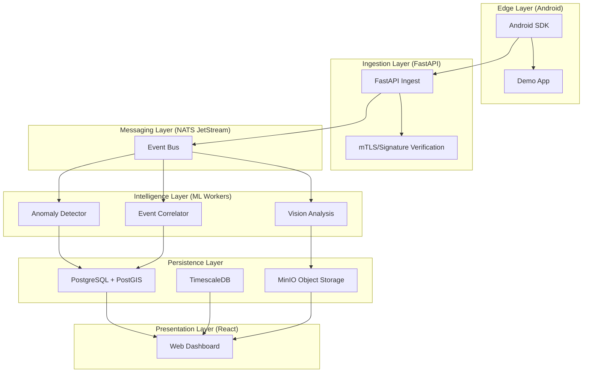

# SESIS System Architecture

## Overview
SESIS (Soberano UE, Coalition-ready, Defensivo) is a multi-agent system designed for high-stakes operational awareness and defense.

## Component Interaction

## Security Model
- **mTLS**: Every connection from Edge to Backend is protected by mutual TLS.
- **Signature**: Every message in the Universal Event Envelope (UEE) format is cryptographically signed by the source asset.
- **ABAC/RBAC**: Policy-based access control for all API resources.
- **Audit**: All writes and critical reads are logged to an append-only audit trail.

## Data Residency
- All data is stored within EU-controlled infrastructure (MinIO, PostgreSQL).
- Encryption at rest and in transit.
